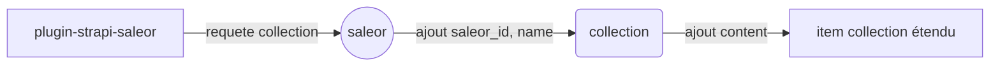
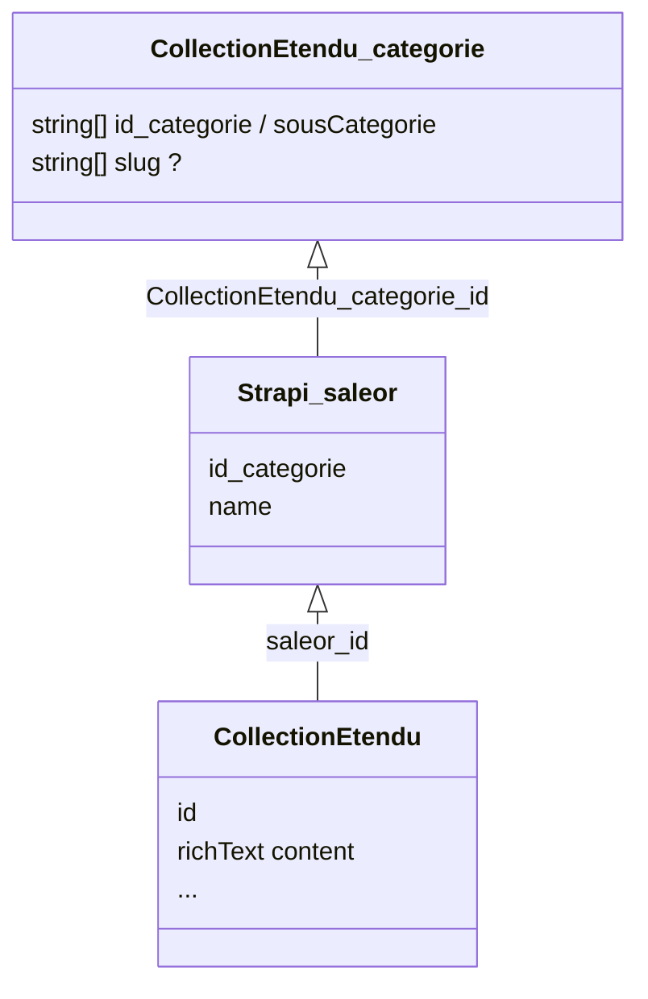
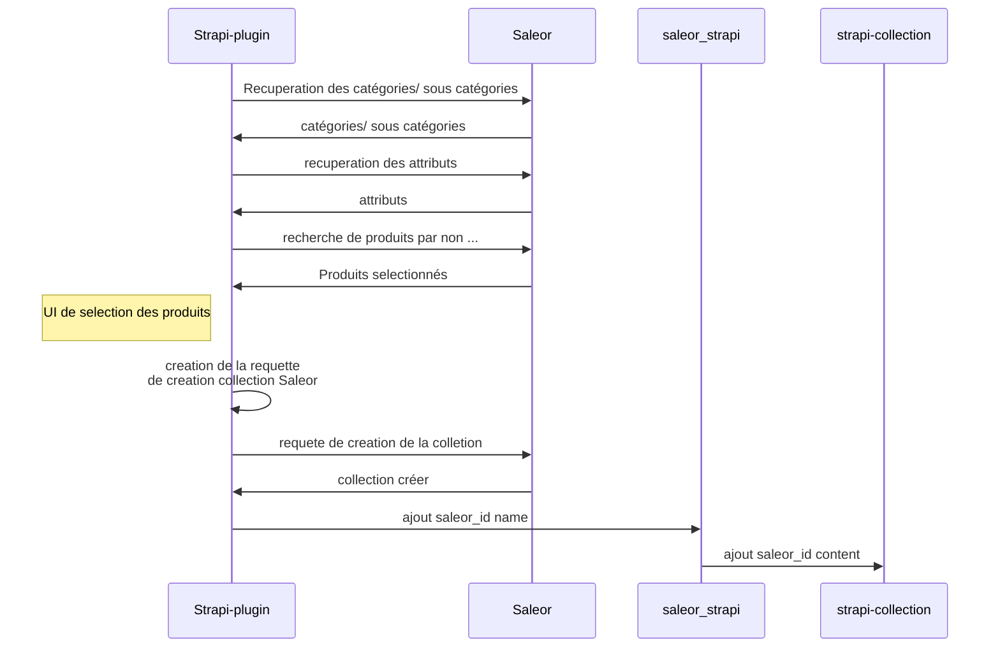

# POC Strapi-Saleor 

> Basé sur l'architecture proposée par Saleor :
[lien](https://saleor.io/blog/combining-headless-architectures-with-saleor-and-strapi-147/) 

# Besoin :

### Etendre les données de saleor pour permettre de créer un frontend performant est adaptable : 

 1. **saleor :**
 permet de gérer le côté métier d'un site e-commerce (prix, stock, user...)
 2. **strapi :** 
permet de servir les données côté front (image, texte riche ...) avec une grande souplesse. Strapi permet d'ajouter et gerer du contenu très facilement. 
 De plus les images sont optimisées au build par Gatsby 

Combiner les deux outils permettrait de créer grâce à la puissance de graphQL un nouveau schema qui repondrait au besoin de Grandes marques à savoir enrichir les contenus proposés et dont dispose Saleor afin d'améliorer le positionnement (SEO) de pages web.

## Migration strapi V4 
### Intérêts : 

 1. Plus simple d'utilisation (interface admin)
 2. Creation de plugin plus facile 
 3. Support strapi (arrêt du support V3 dans 6 mois, donc inévitable)
 4. Marketplace de plugins, d'extensions

## Contenu du POC : 

Créer une table de lien avec  nom  et ID_collection   
Etendre les données de la collection 
### workflow : 

#### Interface strapi :

## A faire :

### Creation d'une collection sur saleor à partir de stapi

 - les collections doivent référencer les catégories  (pour permettre
   l'affichage sur la page voulue)
-  Mettre en meta la regle de creation collection pour pouvoir gerer les futur import de produit : relier automatiquement les nouveaux produits au catégorie existante

### Migration strapi V4

 - migrer la structure du projet de la V3 à la V4
 - nouvelle DB postgresql
 - migrer plugin de livraison 

###  Données strapi  : 
Table de lien + collection de contenus reliée a la table de liens 

 - collection de contenu  : 
	 - Données de catégories / sous catégories 
	 - Rich text 
	 - ... à définir 

## diagrams

Création d'une nouvelle collection saleor :

